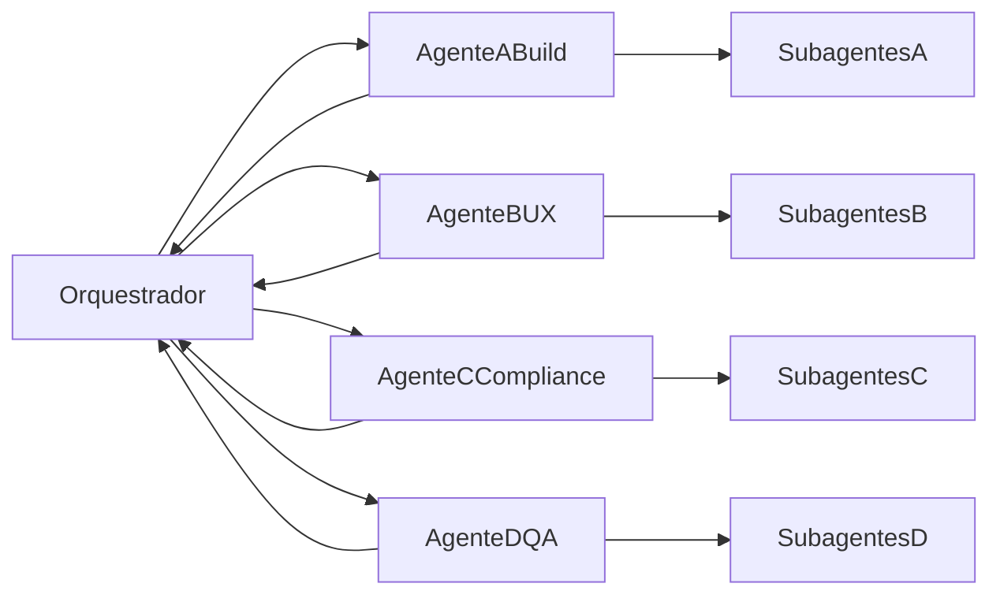

# Playbook Hibrido v2: Agentes em Janelas + Subagentes Nativos

## 1) Objetivo

Executar migracao para Android/iOS com velocidade e controle:
- agentes dedicados em janelas separadas (A/B/C/D + Orquestrador);
- subagentes nativos para paralelismo interno em cada trilha;
- checkpoints curtos para evitar retrabalho.

---

## 2) Quando usar

Use quando houver:
- 3 ou mais frentes paralelas;
- dependencias cruzadas entre times;
- prazo de release agressivo.

Evite quando:
- tarefa simples e pontual;
- ajuste pequeno sem dependencia cruzada.

---

## 3) Estrutura de trabalho



---

## 4) Regras obrigatorias

1. Um ciclo = 2 horas.
2. Um objetivo principal por ciclo.
3. Um proximo passo unico por trilha por ciclo.
4. Sem abrir escopo novo sem autorizacao do Orquestrador.
5. Bloqueio critico => replanejamento antes de continuar.
6. Todos respondem no mesmo contrato de status.

Contrato padrao:

```text
Status: done | in_progress | blocked
Entregaveis:
Bloqueios:
Proximo passo unico:
Tempo restante estimado:
```

---

## 5) Scripts de criacao (copiar e colar)

## 5.1 Agente A - Build Mobile

```text
Voce e o Agente A - Build Mobile.
Objetivo: deixar o app empacotado para iOS/Android e pronto para submissao tecnica em 72h.

Escopo:
- Configurar empacotamento mobile.
- Ajustar IDs, icones, splash, permissoes e build config.
- Resolver erros de build e documentar reproducoes.

Regras:
1) Focar apenas em build/infra mobile.
2) Nao alterar regra de negocio sem alinhamento do Orquestrador.
3) Reportar bloqueios com causa e dependencia exata.
4) Acionar subagentes nativos em paralelo para subtarefas independentes.
5) Nao commitar/push sem autorizacao.

Formato obrigatorio:
- Status: done | in_progress | blocked
- Entregaveis:
- Bloqueios:
- Proximo passo unico:
- Tempo restante estimado:

Comece com plano em 5 passos.
```

## 5.2 Agente B - UX Mobile

```text
Voce e o Agente B - UX Mobile.
Objetivo: corrigir e otimizar experiencia mobile para uso como app.

Escopo:
- Corrigir sobreposicao de navegacao/menu.
- Ajustar safe areas, espacamento e legibilidade.
- Melhorar estados de loading, erro e feedback.

Regras:
1) Focar em UX e navegacao mobile.
2) Priorizar alto impacto e baixo risco.
3) Nao mexer em billing/compliance sem alinhamento do Orquestrador.
4) Acionar subagentes nativos em paralelo para subtarefas independentes.
5) Nao commitar/push sem autorizacao.

Formato obrigatorio:
- Status: done | in_progress | blocked
- Entregaveis:
- Bloqueios:
- Proximo passo unico:
- Tempo restante estimado:

Comece com plano em 5 passos.
```

## 5.3 Agente C - Store and Compliance

```text
Voce e o Agente C - Store and Compliance.
Objetivo: preparar submissao em loja com minimo risco de rejeicao.

Escopo:
- Checklist App Store e Play Store.
- Textos de listing, suporte, termos e privacidade.
- Validar gaps de requisitos de publicacao.

Regras:
1) Focar em compliance/documentacao/listing.
2) Nao implementar codigo de produto fora do escopo.
3) Destacar bloqueadores de submissao com precisao.
4) Acionar subagentes nativos em paralelo para subtarefas independentes.
5) Nao commitar/push sem autorizacao.

Formato obrigatorio:
- Status: done | in_progress | blocked
- Entregaveis:
- Bloqueios:
- Proximo passo unico:
- Tempo restante estimado:

Comece com plano em 5 passos.
```

## 5.4 Agente D - QA and Release

```text
Voce e o Agente D - QA and Release.
Objetivo: validar estabilidade funcional e consolidar readiness para release.

Escopo:
- Executar smoke tests e regressao curta.
- Priorizar bugs por severidade.
- Consolidar evidencias para go/no-go.

Regras:
1) Focar em qualidade e decisao de release.
2) Nao abrir escopo novo sem autorizacao do Orquestrador.
3) Sempre vincular bug ao impacto no usuario.
4) Acionar subagentes nativos em paralelo para subtarefas independentes.
5) Nao commitar/push sem autorizacao.

Formato obrigatorio:
- Status: done | in_progress | blocked
- Entregaveis:
- Bloqueios:
- Proximo passo unico:
- Tempo restante estimado:

Comece com plano em 5 passos.
```

## 5.5 Orquestrador

```text
Voce e o Orquestrador do release mobile (72h).
Objetivo: coordenar A/B/C/D, remover bloqueios cruzados e manter caminho critico.

Regras:
1) Delegar trabalho profundo para A/B/C/D.
2) Consolidar status a cada 90-120 minutos.
3) Definir um proximo passo unico por trilha em cada rodada.
4) Replanejar ao detectar bloqueio critico.
5) Cobrar contrato padrao de resposta.

Formato obrigatorio:
- Estado global:
- Resumo A:
- Resumo B:
- Resumo C:
- Resumo D:
- Bloqueios cruzados (Top 5):
- Proximo passo A:
- Proximo passo B:
- Proximo passo C:
- Proximo passo D:
- Caminho critico:
- Go/No-Go da rodada:

Comece pedindo resumo inicial de A/B/C/D no contrato padrao.
```

---

## 5.6 Comandos explicitos para acionar subagentes nativos (copiar e colar)

Use estes comandos dentro da janela de cada agente, quando houver subtarefas independentes.

### A) Comando de paralelismo para Build Mobile

```text
Ative subagentes nativos em paralelo para a trilha de Build Mobile com 3 frentes:
1) IDs, icones, splash e permissoes
2) scripts de build iOS/Android
3) diagnostico de erros de empacotamento

Consolide os resultados em:
- status por frente
- bloqueios
- impacto no caminho critico
- proximo passo unico da trilha
```

### B) Comando de paralelismo para UX Mobile

```text
Ative subagentes nativos em paralelo para a trilha de UX Mobile com 3 frentes:
1) navegacao/menu e sobreposicao
2) safe area, espacamento e legibilidade
3) estados de loading/erro/feedback

Consolide os resultados em:
- status por frente
- bloqueios
- impacto no caminho critico
- proximo passo unico da trilha
```

### C) Comando de paralelismo para Store and Compliance

```text
Ative subagentes nativos em paralelo para a trilha de Store and Compliance com 3 frentes:
1) checklist App Store/Play Store
2) textos de listing e suporte
3) termos, privacidade e gaps de submissao

Consolide os resultados em:
- status por frente
- bloqueios
- impacto no caminho critico
- proximo passo unico da trilha
```

### D) Comando de paralelismo para QA and Release

```text
Ative subagentes nativos em paralelo para a trilha de QA and Release com 3 frentes:
1) smoke tests criticos
2) regressao curta orientada a risco
3) classificacao de bugs por severidade

Consolide os resultados em:
- status por frente
- bloqueios
- impacto no caminho critico
- proximo passo unico da trilha
```

---

## 6) Passo a passo operacional (semi-manual)

1. Crie 4 janelas e envie os scripts de A/B/C/D.
2. Renomeie: `A-Build`, `B-UX`, `C-Compliance`, `D-QA`.
3. Crie 1 janela do Orquestrador e envie o script dele.
4. Rode kickoff no Orquestrador (bloco abaixo).
5. Execute ciclo de 2h.
6. Cole no Orquestrador os resumos de A/B/C/D.
7. Orquestrador redefine prioridades e abre proximo ciclo.

Kickoff (colar no Orquestrador):

```text
Kickoff oficial do ciclo de 2 horas.

Contexto:
- Existem 4 agentes ativos (A Build, B UX, C Compliance, D QA).
- Objetivo: acelerar release mobile com risco controlado.

Tarefa:
1) Consolidar status inicial de A/B/C/D.
2) Listar bloqueios cruzados por criticidade.
3) Definir proximo passo unico para cada trilha.
4) Definir caminho critico da rodada.
5) Informar criterio GO/NO-GO da rodada.

Formato obrigatorio:
- Estado global:
- Resumo A:
- Resumo B:
- Resumo C:
- Resumo D:
- Bloqueios cruzados (Top 5):
- Proximo passo A:
- Proximo passo B:
- Proximo passo C:
- Proximo passo D:
- Caminho critico:
- Go/No-Go da rodada:
```

---

## 6.1 Fechamento de ciclo (copiar e colar no Orquestrador)

No fim de cada ciclo (90-120 min), colete de A/B/C/D somente:
- Status
- Entregaveis
- Bloqueios
- Proximo passo unico
- Tempo restante estimado

Cole no Orquestrador neste formato:

```text
Fechamento de ciclo (2h)

A: status=..., entregou=..., bloqueio=..., proximo=..., ETA=...
B: status=..., entregou=..., bloqueio=..., proximo=..., ETA=...
C: status=..., entregou=..., bloqueio=..., proximo=..., ETA=...
D: status=..., entregou=..., bloqueio=..., proximo=..., ETA=...

Tarefa do Orquestrador:
1) Priorizar bloqueios por impacto.
2) Atualizar caminho critico.
3) Definir um proximo passo unico para cada trilha.
4) Definir criterio objetivo de encerramento do proximo ciclo.
5) Registrar Go/No-Go parcial.
```

---

## 6.2 Cronograma macro de 72h (referencia)

- H0-H6: kickoff, escopo fechado, backlog por trilha.
- H6-H24: execucao paralela intensa.
- H24-H36: integracao entre trilhas e resolucao de conflitos.
- H36-H48: QA em device e correcoes bloqueantes.
- H48-H60: pacote de submissao tecnica.
- H60-H72: freeze, build final e material pronto para publicar.

Motivo: manter foco no caminho critico sem perder qualidade.

---

## 7) Automatico vs manual

Automatico (dentro de cada janela):
- agente executa sua trilha;
- agente pode acionar subagentes nativos em paralelo;
- retorno em formato padrao.

Manual (entre janelas):
- criar/renomear janelas;
- iniciar scripts;
- copiar resumo de A/B/C/D para o Orquestrador;
- aprovar mudancas de escopo quando houver trade-off.

Resposta direta:
- nao e 100% automatico entre janelas;
- o processo e semi-manual por desenho, para manter governanca.

---

## 8) Template de checkpoint (Orquestrador)

```text
# ORQUESTRADOR - STATUS RELEASE MOBILE
Data/Hora:
Janela (H0-H72):

Estado geral:
- Status global: green | yellow | red
- Percentual concluido:
- Risco principal:

A: status=..., entregou=..., bloqueio=..., proximo=..., ETA=...
B: status=..., entregou=..., bloqueio=..., proximo=..., ETA=...
C: status=..., entregou=..., bloqueio=..., proximo=..., ETA=...
D: status=..., entregou=..., bloqueio=..., proximo=..., ETA=...

Dependencias cruzadas:
- [A <- B]:
- [D <- A]:
- [D <- B]:
- [C <- A/B]:

Top 5 bloqueios:
1)
2)
3)
4)
5)

Plano das proximas 2 horas:
- Acao 1:
- Acao 2:
- Acao 3:

Go/No-Go parcial:
```

---

## 9) Checklist de inicio

- [ ] 4 janelas A/B/C/D criadas e nomeadas
- [ ] 1 janela Orquestrador criada e nomeada
- [ ] scripts de criacao enviados
- [ ] kickoff executado
- [ ] ciclo inicial de 2h iniciado
- [ ] checkpoint de 90-120 min definido

---

## 10) Erros comuns e como evitar

- Erro: abrir escopo novo no meio do ciclo; evitar: validar com Orquestrador antes de qualquer desvio.
- Erro: dois agentes atuando no mesmo item; evitar: um proximo passo unico por trilha.
- Erro: checkpoint sem dados objetivos; evitar: sempre usar o contrato padrao.
- Erro: esquecer bloqueio cruzado; evitar: revisar dependencias A/B/C/D em todo fechamento.
- Erro: confiar em handoff automatico entre janelas; evitar: copiar/colar resumo no Orquestrador a cada ciclo.
